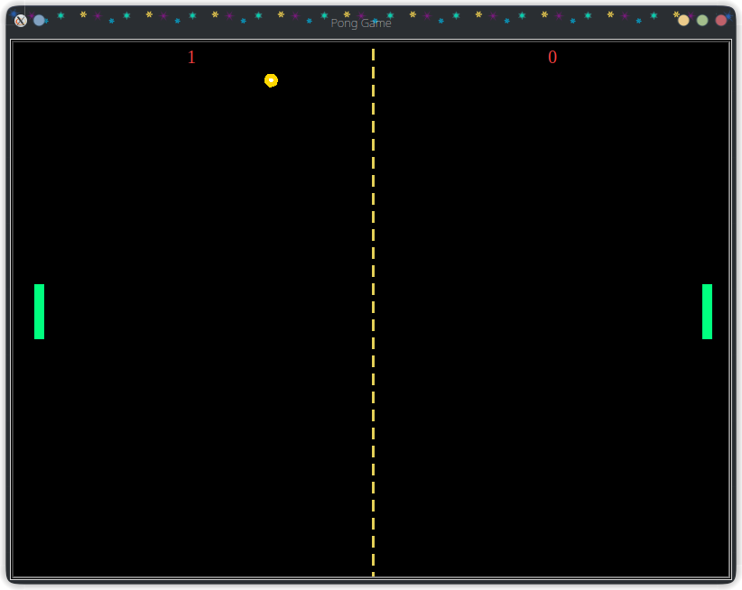

# Pong_Game
<table>
    <tr>
        <td>
            
        </td>
        <td>
            
 
                Pong Game using python's turtle module.
                 Few instructions ...
            

            <ul>
                <li>To start or restart the game press **space** keypad</li>
                <li>To move the left paddle up and down press **w** and **s** keypads respectively</li>
                <li>To move the right paddle up and down press **Up** and **Down** keypads respectively</li>
            </ul>
        </td>
    </tr>
</table>
